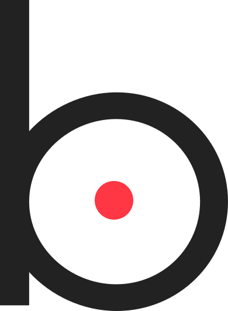

<div id="top"></div>

[![MIT License][license-shield]][license-url]
[![LinkedIn][linkedin-shield]][linkedin-url]

<!-- PROJECT LOGO -->
<br />
<div align="center">
    

  <h3 align="center">Personal Portfolio</h3>

  <p align="center">
    My personal portfolio where I showcase some of my favorite projects.
    <br />
    <a href="https://github.com/vbit27/portfolio"><strong>Explore the docs »</strong></a>
    <br />
    <br />
    <a href="https://vasil.netlify.app/" target="_blank">View Demo</a>
    ·
    <a href="https://github.com/vbit27/portfolio/issues">Report Bug</a>
    
  </p>
</div>

<!-- TABLE OF CONTENTS -->

## Table of Contents

  <ol>
    <li>
      <a href="#about-the-project">About The Project</a>
      <ul>
        <li><a href="#built-with">Built With</a></li>
      </ul>
    </li>
    <li>
      <a href="#getting-started">Getting Started</a>
      <ul>
        <li><a href="#installation">Installation</a></li>
      </ul>
    </li>
    <li><a href="#contributing">Contributing</a></li>
    <li><a href="#license">License</a></li>
    <li><a href="#contact">Contact</a></li>
  </ol>

<!-- ABOUT THE PROJECT -->

## About The Project


This is my first personal portfolio for web development. My goal was to create a very clean, modern and minimal look where my projects can take the spotlight.
<br/>
The most difficult part of this project was deciding how it should look like without making it tedious for the reader.

### Future Work

I am currently creating a separate page for each project, where you will find more information about my thought process and the reasons for the technologies I have chosen.

### Built With

- [Styled Components](https://styled-components.com/)
- [React.js](https://reactjs.org/)
- [TypeScript](https://www.typescriptlang.org/)
- [Gsap](https://greensock.com/gsap/)

<p align="right">(<a href="#top">back to top</a>)</p>

<!-- GETTING STARTED -->

## Getting Started

To get a local copy up and running follow these simple example steps.

### Installation

1. Clone the repo
   ```sh
   git clone https://github.com/vbit27/portfolio.git
   ```
2. Install NPM packages
   ```sh
   npm install
   ```

<p align="right">(<a href="#top">back to top</a>)</p>

<!-- CONTRIBUTING -->

## Contributing

Contributions are what make the open source community such an amazing place to learn, inspire, and create. Any contributions you make are **greatly appreciated**.

If you have a suggestion that would make this better, please fork the repo and create a pull request. You can also simply open an issue with the tag "enhancement".

1. Fork the Project
2. Create your Feature Branch (`git checkout -b feature/AmazingFeature`)
3. Commit your Changes (`git commit -m 'Add some AmazingFeature'`)
4. Push to the Branch (`git push origin feature/AmazingFeature`)
5. Open a Pull Request

<p align="right">(<a href="#top">back to top</a>)</p>

<!-- LICENSE -->

## License

Distributed under the MIT License. See `LICENSE.txt` for more information.

<p align="right">(<a href="#top">back to top</a>)</p>

<!-- CONTACT -->

## Contact

Vasil Bituni - [Linkedin](www.linkedin.com/in/vasilis-bitounis) - vasil.bituni@gmail.com

Project Link: [https://github.com/vbit27/portfolio](https://github.com/vbit27/portfolio)

<p align="right">(<a href="#top">back to top</a>)</p>

<!-- MARKDOWN LINKS & IMAGES -->
<!-- https://www.markdownguide.org/basic-syntax/#reference-style-links -->

[license-shield]: https://img.shields.io/github/license/othneildrew/Best-README-Template.svg?style=for-the-badge
[license-url]: https://github.com/vbit27/recipe-app/blob/main/LICENSE.txt
[linkedin-shield]: https://img.shields.io/badge/-LinkedIn-black.svg?style=for-the-badge&logo=linkedin&colorB=555
[linkedin-url]: https://linkedin.com/in/vasilis-bitounis
